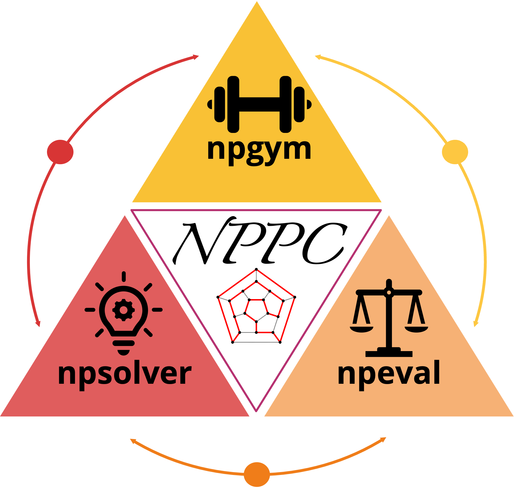

# Nondeterministic Polynomial Problem Challenge

## Problem Suite: npgym

npgym is a suite which provide the unified interface to generate the instances of NP problems and verify the solution. 
npgym ensures that the generated instance has at least one solution, maybe not optimal. 

### List of NP-complete Problems

### List of NP (not yet proved to be NP-complete) Problems

## Solver Suite: npsolver

npsolver is a suite which provide a unified interface for both online models via API
and offline models.

## Evaluation Suite: npeval

## References

Problem list reference: https://www.csc.liv.ac.uk/~ped/teachadmin/COMP202/annotated_np.html

Code repo reference: [TinyZero](https://github.com/Jiayi-Pan/TinyZero)