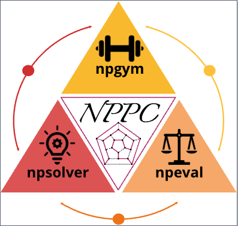

# NPPC: An Ever-Scaling Reasoning Benchmark for LLMs
<div align="center">

</div>

***
To build a successful benchmark for LLMs, we propose Nondeterministic Polynomial-time Problem Challenge (NPPC), which possesses the ever-scalingness with the following four desiderata for a benchmark: 
1. uncrushable, which requires the scaling over the complexity, i.e., the benchmark can generate the problems with continually increasing complexities;
2. unhackable, which requires the scaling over instances, i.e., the benchmark can generate an infinite number of instances to avoid the exploitation;
3. auto-verifiable, which requires the scaling over the scalable oversight, i.e., the benchmark can verify the correctness of the solutions efficiently for the problems with any complexity;
4. general, which requires the scaling over the coverage, i.e., the problems covered by the benchmark should be highly relevant to the real-world problems, rather than some puzzles or rare problems.

To the best of our knowledge, NPPC is the first ever-scaling reasoning benchmark of LLMs, serving as the uncrushable and unhackable testbed for LLMs towards artificial general intelligence (AGI).

## Outline

- [NPPC: An Ever-Scaling Reasoning Benchmark for LLMs](#nppc-an-ever-scaling-reasoning-benchmark-for-llms)
  - [Outline](#outline)
  - [Overview](#overview)
    - [npgym](#npgym) 
    - [npsolver](#npsolver)
    - [npeval](#npeval)
  - [Tutorial](#tutorial)
  - [File Structure](#file-structure)
  - [Team](#team)
  - [License](#license)

## Overview

We introduce the Nondeterministic Polynomial Problem Challenge (NPPC) , an ever-scaling reasoning benchmark for LLMs. There are three main components in NPPC: 
1. **npgym**, which provides a unified interface of 25 well-known NPC problems and can generate any number of instances and verify the solution with any levels of complexities;
2. **npsolver**: which provides a unified interface to evaluate the problem instances with both online and offline models via APIs and local deployments, respectively, to facilitate the users to evaluate their own models;
3. **npeval**: which provides the comprehensive and ready-to-use tools to analyze the performances of LLMs over problems, the number of tokens, the ``aha moments'', the reasoning and solution errors, providing the in-depth analysis of the LLMs' reasoning capabilities.


### npgym
npgym generates the instance $I$ with the given configuration, and the LLM receives the instance and generate the solution $s$, then the solution is verified by npgym with the output $\{\textbf{true}, \textbf{false}\}$. 

Specifically, for each problem, npgym implements two functions:  generate_instance(·) and verify_solution(·). 

Different NPC problems exhibit distinct combinatorial structures and computational characteristics. To establish a standardized metric for quantifying the computational complexity of these problems, npgym implements the difficulty levels. 

All the NPC problems and the difficulty level configurations are stored in [config.py](npgym/configs.py).

| # | NPC Problem | Type | Functions | #Levels |
|---|------------|------|-----------|----------|
| 1 | 3-Satisfiability (3SAT) | core | [three_sat.py](npgym/npc/three_sat.py) | 10 |
| 2 | Vertex Cover | core | [vertex_cover.py](npgym/npc/vertex_cover.py) | 10 |
| 3 | 3-Dimensional Matching (3DM) | core | [three_dimension_matching.py](npgym/npc/three_dimension_matching.py) | 10 |
| 4 | Travelling Salesman (TSP) | core | [tsp.py](npgym/npc/tsp.py) | 10 |
| 5 | Hamiltonian Cycle | core | [hamiltonian_cycle.py](npgym/npc/hamiltonian_cycle.py) | 10 |
| 6 | Graph 3-Colourability (3-COL) | core | [graph_three_colorability.py](npgym/npc/graph_three_colorability.py) | 10 |
| 7 | Bin Packing | core | [bin_packing.py](npgym/npc/bin_packing.py) | 10 |
| 8 | Maximum Leaf Spanning Tree | core | [max_leaf_span_tree.py](npgym/npc/max_leaf_span_tree.py) | 10 |
| 9 | Quadratic Diophantine Equations (QDE) | core | [quad_diop_equ.py](npgym/npc/quad_diop_equ.py) | 10 |
| 10 | Minimum Sum of Squares | core | [min_sum_square.py](npgym/npc/min_sum_square.py) | 10 |
| 11 | Shortest Common Superstring | core | [shortest_common_superstring.py](npgym/npc/shortest_common_superstring.py) | 10 |
| 12 | Bandwidth | core | [bandwidth.py](npgym/npc/bandwidth.py) | 10 |
| 13 | Clique | extension | [clique.py](npgym/npc/clique.py) | 13 |
| 14 | Independent Set | extension | [independent_set.py](npgym/npc/independent_set.py) | 13 |
| 15 | Dominating Set | extension | [domninating_set.py](npgym/npc/domninating_set.py) | 12 |
| 16 | Set Splitting | extension | [set_splitting.py](npgym/npc/set_splitting.py) | 11 |
| 17 | Set Packing | extension | [set_packing.py](npgym/npc/set_packing.py) | 11 |
| 18 | Exact Cover by 3-Sets (X3C) | extension | [exact_cover.py](npgym/npc/exact_cover.py) | 10 |
| 19 | Minimum Cover | extension | [minimum_cover.py](npgym/npc/minimum_cover.py) | 16 |
| 20 | Partition | extension | [partition.py](npgym/npc/partition.py) | 13 |
| 21 | Subset Sum | extension | [subset_sum.py](npgym/npc/subset_sum.py) | 13 |
| 22 | Hitting String | extension | [hitting_string.py](npgym/npc/hitting_string.py) | 10 |
| 23 | Quadratic Congruences | extension | [quadratic_congruence.py](npgym/npc/quadratic_congruence.py) | 10 |
| 24 | Betweenness | extension | [betweenness.py](npgym/npc/betweenness.py) | 6 |
| 25 | Clustering | extension | [clustering.py](npgym/npc/clustering.py) | 10 |


### npsolver
npsolver uses a simple and consistent prompt template across all problems that includes: problem description, context examples, target instance, and solution format requirements in JSON. The solver suite handles prompt generation, LLM completion (via LiteLLM for online APIs and vLLM for offline models), solution extraction using regex parsing, and standardized error reporting. This unified interface enables seamless evaluation across different LLM deployment types.

The nppc_template and all the NPC problems' definations are stored in [prompt.py](npsolver/prompt.py).

### npeval
npeval implements a statistically sound sampling strategy by evaluating 30 instances per seed across multiple seeds for each difficulty level. The suite offers four key performance measures: inter-quantile mean (IQM), mean, median, and optimality gap, along with stratified bootstrap confidence intervals for reliable interval estimation. NPEval analyzes both prompt and completion tokens across problems and difficulty levels, tracks "aha moments" in reasoning processes, and examines both solution verification errors from npgym and reasoning errors in LLMs' internal problem-solving processes. This systematic approach enables thorough performance analysis while managing computational costs and accounting for randomness in both instance generation and LLM responses.


## Tutorial

### Configure API Keys

Put your API keys into the folder `api_keys`
```python
nppc/
├── api_keys/                
│   ├── openai_api_key.txt/
│   ├── huoshan_api_key.txt/             
│   ├── deepseek_api_key.txt/
|   ├── claude_api_key.txt/
│   └── maas_api_key.txt
```

### Run Evaluation
```python
python3 main_nppc_final.py --seed 64 --model claude --problem 11 --result_folder results
```
| Argument | Definition | Values |
|----------|------------|---------|
| --seed | seed | |
| --model | name for LLM | [example models](npsolver/__init__.py)|
| --problem | the problem name idx | [configs](npgym/configs.py) |
| --level | difficulty level | [configs](npgym/configs.py) |
| --n_shots | number of in-context examples | |
| --n_trials | number of trials for each level | |
| --batch_size | the problem name | |
| --max_tries | max tries for one batch | |
| --result_folder | folder path to store the results | |
| --verbose | verbose output | |


### Plot Results
```bash
cd plottings
python main_performance_all.py
```


## File Structure
```
nppc/
├── npgym/
│   ├── npc/                
│   │   ├── __init__.py
│   │   ├── base.py
│   │   ├── betweenness.py
│   │   ├── bin_packing.py
│   │   ├── bipartite_subgraph.py
│   │   ├── clique.py
│   │   ├── clustering.py
│   │   ├── cubic_subgraph.py
│   │   ├── dominating_set.py
│   │   ├── edge_colouring.py
│   │   ├── exact_cover.py
│   │   ├── graph_three_colorability.py
│   │   ├── hamiltonian_cycle.py
│   │   ├── hamming_center.py
│   │   ├── hitting_string.py
│   │   ├── independent_set.py
│   │   ├── k_closure.py
│   │   ├── kernel.py
│   │   ├── longest_circuits.py
│   │   ├── longest_path.py
│   │   ├── max_leaf_span_tree.py
│   │   ├── min_sum_square.py
│   │   ├── mini_test_set.py
│   │   ├── minimum_cover.py
│   │   ├── multiprocessor_scheduling.py
│   │   ├── n_queen_completion.py
│   │   ├── open_hemisphere.py
│   │   ├── optimal_linear_arrangement.py
│   │   ├── partition_into_triangle.py
│   │   ├── partition.py
│   │   ├── quad_diop_equ.py
│   │   ├── quadratic_congruence.py
│   │   ├── rural_postman.py
│   │   ├── set_packing.py
│   │   ├── set_splitting.py
│   │   ├── shortest_common_superstring.py
│   │   ├── simulanteous_incongruences.py
│   │   ├── solitarie.py
│   │   ├── subset_product.py
│   │   ├── subset_sum.py
│   │   ├── three_dimension_matching.py
│   │   ├── three_partition.py
│   │   ├── three_sat.py
│   │   ├── tsp.py
│   │   ├── vertex_cover.py
│   │   └── x3c.py
│   └── nphard/            
│   │   ├── __init__.py
│   │   └── bin_packing.py
│   ├── __init__.py
│   ├── configs.py
│   └── core.py
├── npsolver/              
│   ├── __init__.py    
│   ├── prompt.py
│   └── solver.py
├── npeval/                
│   ├── __init__.py    
│   ├── interval.py
│   ├── library.py
│   ├── metrics.py
│   └── plot_utils.py
├── plottings/
│   ├── __init__.py
│   ├── main_aha.py
│   ├── main_error_type.py
│   ├── main_full_results.py
│   ├── main_interval.py
│   ├── main_performance_all.py
│   ├── main_rank.py
│   └── main_tokens.py
├── scripts/          
│   └── gen_scripts.py
├── README.MD
├── eval.sh
└── main_nppc_final.py
```

## Team
- This repository is developed and maintained by the authors of this paper [Nondeterministic Polynomial-time Problem Challenge: An Ever-Scaling Reasoning Benchmark for LLMs](https://arxiv.org/abs/2504.11239) 

## License

This project is licensed under the MIT License - see the [LICENSE](LICENSE) file for details.