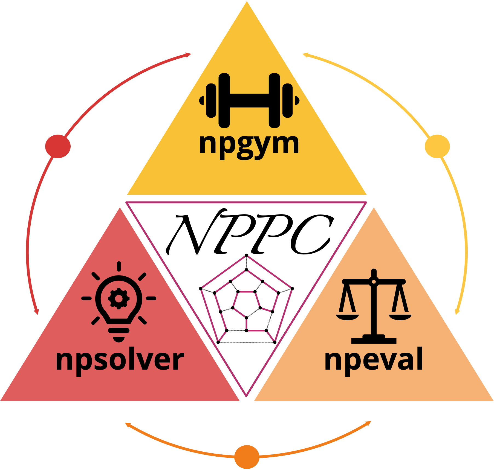

# Nondeterministic Polynomial Problem Challenge

## List of NP problems

### List of NP-complete Problems

0: three_partition.py

1: min_sum_square.py

2: cubic_subgraph.py

3: simulanteous_incongruences.py

4: rural_postman.py

5: multiprocessor_scheduling.py

6: partition.py

7: clustering.py

8: n_queen_completion.py

9: clique.py

10: partition_into_triangle.py

11: open_hemisphere.py

12: shortest_common_superstring.py

13: quad_diop_equ.py

14: longest_circuits.py

15: subset_sum.py

16: bin_packing.py

17: domninating_set.py

18: set_packing.py

19: bandwidth.py

20: three_sat.py

21: bipartite_subgraph.py

22: solitarie.py

23: minimum_cover.py

24: subset_product.py

25: tsp.py

26: vertex_cover.py

27: betweenness.py

28: longest_path.py

29: x3c.py

30: set_spliting.py

31: mini_test_set.py

32: independent_set.py

33: optimal_linear_arrangement.py

34: quadratic_congruence.py

35: k_closure.py

36: hamming_center.py

37: three_dimension_matching.py

38: max_leaf_span_tree.py

39: graph_three_colorability.py

40: hitting_string.py

41: edge_colouring.py

42: hamiltonian_cycle.py

43: exact_cover.py

### List of NP (not yet proved to be NP-complete) Problems

## References

Problem list reference: https://www.csc.liv.ac.uk/~ped/teachadmin/COMP202/annotated_np.html

Code repo reference: [TinyZero](https://github.com/Jiayi-Pan/TinyZero)